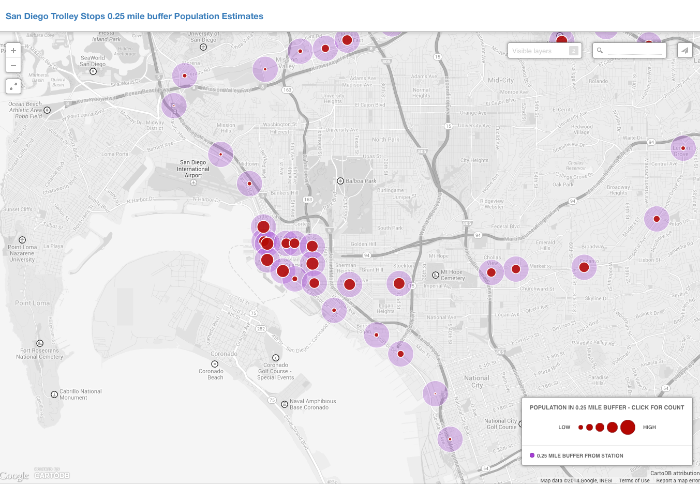

#Population Estimate for VOSD

Population Estimate using two buffers 0.25 and 0.50 mile with data from area weighed interpolation (buffer, intersect, dissolve sum)

For American Community Survey (ACS) 2008 - 2012 5-year Tract and Block Group & 2010 Census Block.

##Data Dictionary:
######stop_id
Station Unique ID
######stop_name
Station Name
######stop_lat
Station Latitude (WGS 84?)
######stop_lon
Station Longitude (WGS 84?)n
######bg2012popbuf025miles
ACS 2012 5-year Block Group Population Estimate for 0.25 Buffer from Station point
######ct2012popbuf025miles
ACS 2012 5-year Tract Population Estimate for 0.25 Buffer from Station point
######bl2010popbuf025miles
Census 2010 Block Population Estimate for 0.25 Buffer from Station point
######bg2012popbuf050miles
ACS 2012 5-year Block Group Population Estimate for 0.50 Buffer from Station point
######ct2012popbuf050miles
ACS 2012 5-year Tract Population Estimate for 0.50 Buffer from Station point
######bl2010popbuf050miles
Census 2010 Block Population Estimate for 0.50 Buffer from Station point

##Caveats

San Ysidro/Intl Border station buffers cross border - Mexico pop estimates not included - US estimates only

##Map

